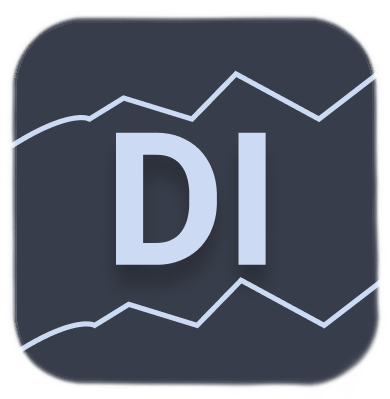

<h2 align="center">DarkBlue Ice Theme</h2>

   

<h3 align="center"> A Beautiful theme for many apps with Dark blue and ice colors distributed in a harmonic way. </h3>

---

## Themes

* ### [DarkBlue Ice for vscode](https://github.com/Dedsd/DarkBlue-Ice-for-vscode)
* ### [DarkBlue Ice for atom](https://github.com/Dedsd/DarkBlue-Ice-for-atom)
* ### [DarkBlue Ice for vim](https://github.com/Dedsd/DarkBlue-Ice-for-vim)
* ### [DarkBlue Ice for firefox](https://github.com/Dedsd/DarkBlue-Ice-for-firefox)
* ### [DarkBlue Ice for telegram](https://github.com/Dedsd/DarkBlue-Ice-for-telegram)
* ### [DarkBlue Ice for customdiscord](https://github.com/Dedsd/DarkBlue-Ice-for-customdiscord)
* ### [DarkBlue Ice for mailspring](https://github.com/Dedsd/DarkBlue-Ice-for-Mailspring)
* ### [DarkBlue Ice for gnome terminal](https://github.com/Dedsd/DarkBlue-Ice-for-gnome-terminal)
* ### [DarkBlue Ice for ulauncher](https://github.com/Dedsd/DarkBlue-Ice-for-ulauncher)
* ### [DarkBlue Ice for termux](https://github.com/Dedsd/DarkBlue-Ice-for-termux)

---

## How to submit a theme

### If you would like to volunteer and submit a theme to add to the DarkBlue Ice collection, you can create a feature request in the issues section on github. We will evaluate it and decide whether the theme will be added or not. We will give you the credits and you will help maintain this project.

---

## Color pallet

| HEX     | RGB      | COLOR IMAGES
| --------| ---------| ------------------|
| #2A2F3B | 42 47 59 | 
| #39404D | 57 64 77 | 
| #454e63 | 69 78 99 | 
| #556077 | 85 96 119| 
| #202F4E | 32 47 78 | 
| #283A61 | 40 58 97 | 
| #3B4C70 | 59 76 112| 
| #4E5C7A | 78 92 122| 
| #C3D6F9 | 195 214 249| 
| #CDDAF3 | 205 218 243| 
| #DBE4F5 | 219 228 245| 
| #F4F6FA | 244 246 250| 
| #919DB3 | 145 157 179| 
| #9FABBF | 159 171 191| 
| #A8B5CD | 168 181 205| 
| #AEBBD2 | 174 187 210| 

---

Made by [André V.](https://github.com/Dedsd)